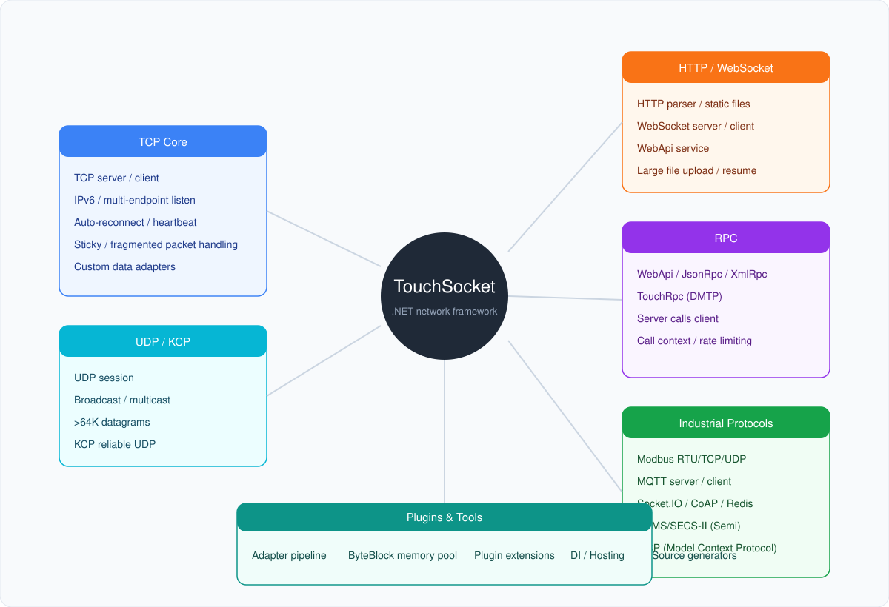

**En** | [中文](./README.zh.md)

<p align="center">
  
</p>

<h1 align="center">TouchSocket</h1>

<p align="center">
  A simple, modern, and high-performance .NET networking framework
</p>

<div align="center">

[](https://www.nuget.org/packages/TouchSocket/)
[](https://www.nuget.org/packages/TouchSocket/)
[](https://www.apache.org/licenses/LICENSE-2.0.html)
[](https://github.com/RRQM/TouchSocket)
[](https://gitee.com/RRQM_Home/TouchSocket/stargazers)
[](https://jq.qq.com/?_wv=1027&k=gN7UL4fw)

</div>

<p align="center">
  <a href="https://touchsocket.net/">Documentation</a> ·
  <a href="https://touchsocket.net/docs/current/startguide">Getting Started</a> ·
  <a href="https://touchsocket.net/api/">API Reference</a> ·
  <a href="./examples">Examples</a>
</p>

---

## 30-Second Overview

**TouchSocket** is an integrated .NET networking framework covering **TCP / UDP / WebSocket / HTTP / MQTT / Modbus / RPC / MCP** and more. It ships with a memory pool, data-adapter pipeline, plugin system, DI / Hosting integration, and source generators.

Whether you are building a TCP server, an industrial device gateway, or an AI tool based on MCP, TouchSocket provides a unified API to get you there quickly.

---

## Feature Map

<p align="center">
  
</p>

---

## Core Capabilities

| Capability | Description |
|---|---|
| **High-Performance IOCP** | Each receive uses a writable block from the memory pool with zero extra copies; up to ~10× throughput vs. traditional implementations in 100k × 64KB stress tests |
| **Data Adapters** | Fixed-header, fixed-length, terminator, HTTP, WebSocket templates; hot-swappable; automatic sticky/fragmented packet handling |
| **Plugin System** | Reconnection, heartbeat, SSL, authentication, logging via `.ConfigurePlugins()` across the full communication lifecycle |
| **Unified API** | TCP / UDP / WebSocket / NamedPipe / SerialPort all use `ConnectAsync / SendAsync / Received` |
| **Memory Pool** | ByteBlock, MemoryPool, Span / Memory optimized for low GC pressure under heavy traffic |
| **Source Generators** | AOT-friendly generation for RPC proxies, serialization, dependency properties, plugin raises |
| **Multi-Target** | .NET Framework 4.6.2 / .NET Standard 2.0 / .NET 6 / 8 / 10 |

---

## Package Quick Reference

| Category | NuGet Package | One-Liner |
|---|---|---|
| Core | `TouchSocket.Core` | Memory pool, ByteBlock, adapter base, IOC, logging, plugins, serialization |
| Transport | `TouchSocket` | TCP / UDP / SSL, KCP, NAT, WaitingClient, sticky/fragment handling |
|  | `TouchSocket.NamedPipe` | Named-pipe IPC, ~3× faster than TCP |
|  | `TouchSocket.SerialPorts` | Serial-port communication with adapter templates |
|  | `TouchSocket.AspNetCore` | ASP.NET Core integration |
|  | `TouchSocket.Hosting` | Generic Host support (Worker Service, etc.) |
| HTTP / Web | `TouchSocket.Http` | HTTP/1.1 server/client, WebSocket, large-file transfer |
|  | `TouchSocket.WebApi` | WebApi server + client with Swagger |
|  | `TouchSocket.SocketIo` | Socket.IO client (v3/v4) |
| RPC | `TouchSocket.Rpc` | RPC platform: registration, dispatch, execution, invocation |
|  | `TouchSocket.Dmtp` | DMTP protocol: RPC, file transfer, channels, routing, Redis |
|  | `TouchSocket.JsonRpc` / `TouchSocket.XmlRpc` | JSON / XML RPC |
| IoT / Industrial | `TouchSocket.Modbus` | Modbus RTU/ASCII/TCP master |
|  | `TouchSocket.Mqtt` | MQTT server / client |
|  | `TouchSocket.Semi` | HSMS/SECS-II semiconductor protocols |
|  | `TouchSocket.CoAP` | CoAP over UDP |
|  | `TouchSocket.Redis` | Redis client + in-memory compatible server |
| AI | `TouchSocket.Mcp` | MCP server / client (stdio / Streamable HTTP) |
| Extensions | `TouchSocket.Core.DependencyInjection` / `.Autofac` | Microsoft DI / Autofac adapters |
|  | `TouchSocket.Rpc.RateLimiting` | RPC rate limiting |
|  | `*.*.SourceGenerator` | Source generators for each package |

> All NuGet packages starting with `TouchSocket.` are fully open-source and free for personal/commercial use. The `TouchSocketPro.` line requires a commercial license.

---

## Quick Start

### Install

```bash
dotnet add package TouchSocket
```

### Minimal TCP Server

```csharp
var service = new TcpService();
service.Received = (client, e) =>
{
    Console.WriteLine($"Received: {e.Memory.Span.ToString(Encoding.UTF8)}");
    return EasyTask.CompletedTask;
};
await service.StartAsync(7789);
```

### Minimal TCP Client

```csharp
var client = new TcpClient();
client.Received = (c, e) =>
{
    Console.WriteLine(e.Memory.Span.ToString());
    return EasyTask.CompletedTask;
};
await client.ConnectAsync("127.0.0.1:7789");
await client.SendAsync("Hello");
```

### Auto-Reconnect

```csharp
client.ConfigurePlugins(a => a.UseReconnection<TcpClient>());
```

More examples are in [examples](./examples).

---

## Performance

| Implementation | Memory Handling | Performance Impact |
|---|---|---|
| Traditional IOCP (fixed buffer) | Received data must be copied again | Extra overhead under load |
| **TouchSocket IOCP** | Receives directly into a memory-pool block | **Zero extra copies**, significant gain at scale |

Stress test: **100k messages × 64KB** — TouchSocket achieves **up to ~10×** the throughput of traditional implementations.

Named-pipe simple send/receive reaches **6.5 Gb/s**, about **3× faster than TCP**, with negligible GC.

---

## Documentation

- [Documentation Home](https://touchsocket.net/)
- [Getting Started](https://touchsocket.net/docs/current/startguide)
- [API Reference](https://touchsocket.net/api/)
- [Video Course](https://touchsocket.net/docs/current/video)

---

## License & Support

TouchSocket is licensed under **Apache License 2.0**. All `TouchSocket.*` NuGet packages are free for personal and commercial use.

The `TouchSocketPro.*` line is commercially licensed. See [Pro Edition](https://touchsocket.net/docs/current/enterprise) for details.

---

## Contact

- [CSDN Blog](https://blog.csdn.net/qq_40374647)
- [Bilibili Videos](https://space.bilibili.com/94253567)
- QQ Group: **234762506**

TouchSocket is a member of the **dotNET China** organization.
