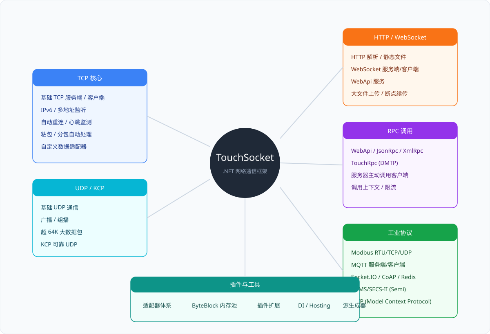

**中** | [En](./README.md)

<p align="center">
  
</p>

<h1 align="center">TouchSocket</h1>

<p align="center">
  简洁 · 现代 · 高性能的 .NET 网络通信框架
</p>

<div align="center">

[](https://www.nuget.org/packages/TouchSocket/)
[](https://www.nuget.org/packages/TouchSocket/)
[](https://www.apache.org/licenses/LICENSE-2.0.html)
[](https://github.com/RRQM/TouchSocket)
[](https://gitee.com/RRQM_Home/TouchSocket/stargazers)
[](https://jq.qq.com/?_wv=1027&k=gN7UL4fw)

</div>

<p align="center">
  <a href="https://touchsocket.net/">文档首页</a> ·
  <a href="https://touchsocket.net/docs/current/startguide">快速开始</a> ·
  <a href="https://touchsocket.net/api/">API 参考</a> ·
  <a href="./examples">示例代码</a>
</p>

---

## 30 秒看懂

**TouchSocket** 是一个面向 .NET 的整合性网络通信框架，覆盖 **TCP / UDP / WebSocket / HTTP / MQTT / Modbus / RPC / MCP** 等协议，并提供内存池、数据适配器、插件系统、DI / Hosting、源生成器等基础设施。

无论你是写一个 TCP 服务端、工业设备网关，还是基于 MCP 的 AI 工具，TouchSocket 都能用一套统一的 API 帮你快速落地。

---

## 功能全景

<p align="center">
  
</p>

---

## 核心能力

| 能力 | 说明 |
|---|---|
| **高性能 IOCP** | 每次接收直接从内存池分配可写块，零额外拷贝；10 万 × 64KB 压测可达传统实现约 10 倍吞吐 |
| **数据适配器** | 固定包头、固定长度、终止字符、HTTP、WebSocket 等模板；热插拔，自动处理粘包/分包 |
| **插件系统** | 重连、心跳、SSL、鉴权、日志等通过 `.ConfigurePlugins()` 挂载，贯穿通信生命周期 |
| **统一 API** | TCP / UDP / WebSocket / NamedPipe / SerialPort 均使用 `ConnectAsync / SendAsync / Received` |
| **内存池** | ByteBlock、MemoryPool、Span / Memory 深度优化，高流量下保持低 GC |
| **源生成器** | RPC 代理、序列化、依赖属性、插件触发等 AOT 友好生成 |
| **多目标框架** | .NET Framework 4.6.2 / .NET Standard 2.0 / .NET 6 / 8 / 10 |

---

## 模块速查

| 分类 | NuGet 包 | 一句话说明 |
|---|---|---|
| 核心基础 | `TouchSocket.Core` | 内存池、ByteBlock、适配器基类、IOC、日志、插件、序列化 |
| 传输层 | `TouchSocket` | TCP / UDP / SSL、KCP、NAT、WaitingClient、粘包/分包处理 |
|  | `TouchSocket.NamedPipe` | 命名管道 IPC，性能约为 TCP 的 3 倍 |
|  | `TouchSocket.SerialPorts` | 串口通信，支持协议模板 |
|  | `TouchSocket.AspNetCore` | ASP.NET Core 专用集成 |
|  | `TouchSocket.Hosting` | 通用主机托管（Worker Service 等）|
| HTTP / Web | `TouchSocket.Http` | HTTP/1.1 服务端/客户端、WebSocket、大文件传输 |
|  | `TouchSocket.WebApi` | WebApi 服务 + 客户端，支持 Swagger |
|  | `TouchSocket.SocketIo` | Socket.IO 客户端（v3/v4）|
| RPC | `TouchSocket.Rpc` | RPC 平台：注册、调度、执行、调用规范 |
|  | `TouchSocket.Dmtp` | DMTP 双工协议：RPC、文件传输、Channel、路由、Redis |
|  | `TouchSocket.JsonRpc` / `TouchSocket.XmlRpc` | JSON / XML RPC |
| 物联网 / 工业 | `TouchSocket.Modbus` | Modbus RTU/ASCII/TCP 主站 |
|  | `TouchSocket.Mqtt` | MQTT 服务端/客户端 |
|  | `TouchSocket.Semi` | HSMS/SECS-II 半导体协议 |
|  | `TouchSocket.CoAP` | CoAP over UDP |
|  | `TouchSocket.Redis` | Redis 客户端 + 内存兼容服务端 |
| AI | `TouchSocket.Mcp` | MCP 服务器/客户端（stdio / Streamable HTTP）|
| 扩展 | `TouchSocket.Core.DependencyInjection` / `.Autofac` | 微软 DI / Autofac 适配 |
|  | `TouchSocket.Rpc.RateLimiting` | RPC 限流 |
|  | `*.*.SourceGenerator` | 各包配套的源生成器 |

> 所有以 `TouchSocket.` 开头的 NuGet 包均已完全开源，个人/商用均可免费使用。`TouchSocketPro.` 系列为商业授权。

---

## 快速开始

### 安装

```bash
dotnet add package TouchSocket
```

### 最小 TCP 服务端

```csharp
var service = new TcpService();
service.Received = (client, e) =>
{
    Console.WriteLine($"收到：{e.Memory.Span.ToString(Encoding.UTF8)}");
    return EasyTask.CompletedTask;
};
await service.StartAsync(7789);
```

### 最小 TCP 客户端

```csharp
var client = new TcpClient();
client.Received = (c, e) =>
{
    Console.WriteLine(e.Memory.Span.ToString());
    return EasyTask.CompletedTask;
};
await client.ConnectAsync("127.0.0.1:7789");
await client.SendAsync("Hello");
```

### 断线重连

```csharp
client.ConfigurePlugins(a => a.UseReconnection<TcpClient>());
```

更多示例见 [examples](./examples)。

---

## 性能

| 实现 | 内存处理 | 性能影响 |
|---|---|---|
| 传统 IOCP（固定缓冲区） | 收到后需再拷贝一次 | 高并发下额外开销 |
| **TouchSocket IOCP** | 直接从内存池取块接收 | **零额外拷贝**，大流量显著提升 |

压测：连续传输 **10 万条 × 64KB**，TouchSocket 吞吐可达传统实现的 **约 10 倍**。

命名管道简单收发测试达 **6.5 Gb/s**，约为 TCP 的 **3 倍**，且无明显 GC。

---

## 文档

- [文档首页](https://touchsocket.net/)
- [快速入门](https://touchsocket.net/docs/current/startguide)
- [API 文档](https://touchsocket.net/api/)
- [视频课程](https://touchsocket.net/docs/current/video)

---

## 支持与授权

TouchSocket 遵循 **Apache License 2.0** 开源协议，所有 `TouchSocket.*` NuGet 包均可免费用于个人/商业项目。

`TouchSocketPro.*` 系列为商业授权，如需了解请查看 [Pro 版本](https://touchsocket.net/docs/current/enterprise)。

---

## 联系

- [CSDN 博客](https://blog.csdn.net/qq_40374647)
- [B 站视频](https://space.bilibili.com/94253567)
- QQ 群：**234762506**

TouchSocket 已加入 **dotNET China** 组织。
